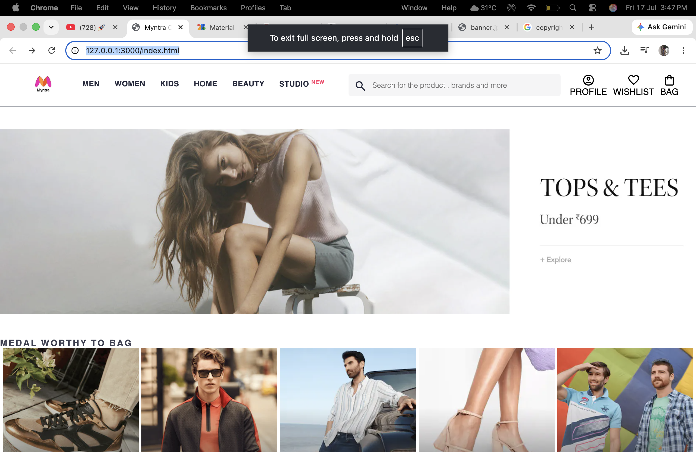
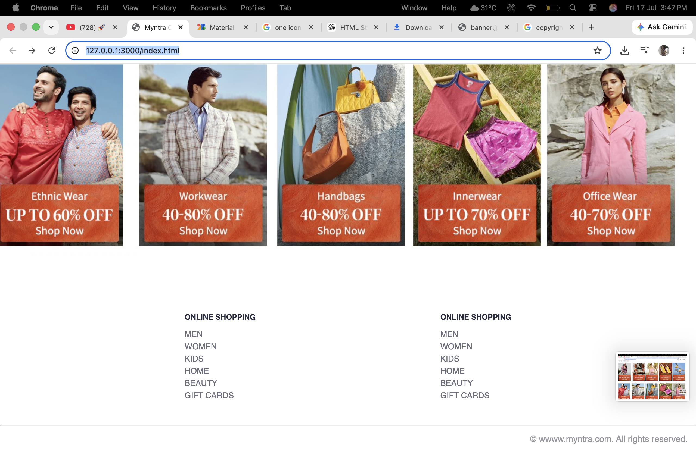

# 🛍️ Myntra Clone

A responsive front-end clone of the Myntra homepage built using **HTML5** and **CSS3**. This project recreates the layout and design of the official Myntra landing page to practice modern web development concepts.

---

## 🚀 Features

- Responsive Header
- Navigation Bar
- Search Bar
- Material Icons
- Hero Banner
- Product Sections
- Shop by Category
- Footer
- Hover Effects
- Clean Folder Structure

---

## 🛠️ Tech Stack

- HTML5
- CSS3
- Google Material Symbols

---

## 📸 Screenshots

### 🏠 Homepage



---

### 🛍️ Product Section


---

### 🛒 Shop by Category


---

### 📄 Footer



---

## 📂 Project Structure

```
Myntra_Clone/
│
├── images1/
│   ├── clothes_images/
│   ├── categories/
│   ├── banner.jpg
│   └── logo_myntra.png
│
├── index.html
├── style.css
└── README.md
```

---

## 🎯 What I Learned

- Flexbox Layout
- Responsive Design Basics
- Google Material Icons
- Image Organization
- CSS Hover Effects
- Building Real Website Clones
- Clean HTML Structure

---

## 🔮 Future Improvements

- Fully Responsive Design
- JavaScript Functionality
- Dark Mode
- Product Hover Animations
- Dropdown Navigation
- Shopping Cart Functionality

---

## 👨‍💻 Author

**Sukhman Dult**

GitHub: https://github.com/YOUR_USERNAME